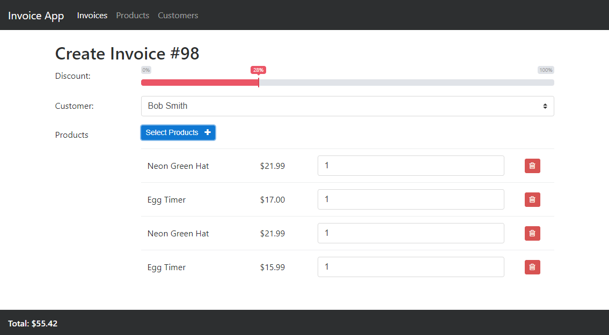

# Dependencies

- sqlite3
- node
- npm
- angular@4.2.4
- angular-cli@1.4.3
- bootstrap@4.0.0-alpha.6 (very latest version)

# Getting Started

###### Install npm dependencies
`npm install`

###### Build project
`ng build`

###### Run the node server
`node app.js`

###### Viewing the application in your browser
`http://localhost:8000`


####### Run develop version
`npm start`

# Schema

## Customers

- id (integer)
- name (string)
- address (string)
- phone (string)


## Products

- id (integer)
- name (string)
- price (decimal)

## Invoices

- id (integer)
- customer_id (integer)
- discount (decimal)
- total (decimal)

## InvoiceItems

- id (integer)
- invoice_id (integer)
- product_id (integer)
- quantity (decimal)


# Resources

## Customers
```
GET|POST          /api/customers
GET|PUT|DELETE    /api/customers/{id}
```

## Products
```
GET|POST          /api/products
GET|PUT|DELETE    /api/products/{id}
```
## Invoices
```
GET|POST          /api/invoices
GET|PUT|DELETE    /api/invoices/{id}
```

## InvoiceItems
```
GET|POST          /api/invoices/{id}/items
GET|PUT|DELETE    /api/invoices/{invoice_id}/items/{id}
```


